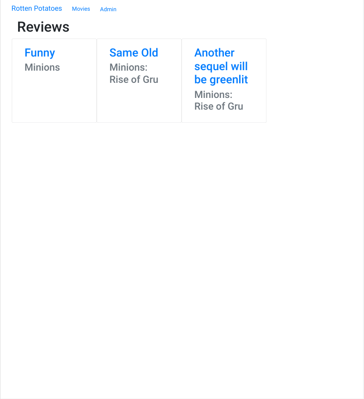
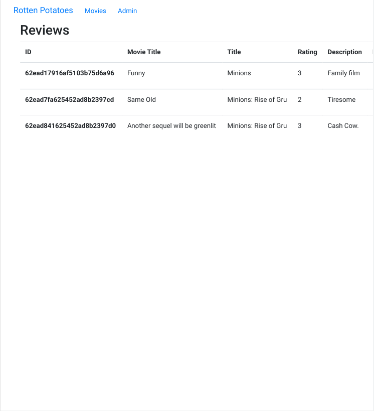

<h1 align="center">Rotten Potatoes Part Deux</h1>

<div align="center">
   Tutorial from  <a href="https://makeschool.org/mediabook/oa/tutorials/rotten-potatoes---movie-reviews-with-express-js-rge/making-a-plan/" target="_blank">makeschool.org</a>.
</div>

## Table of Contents

- [Overview](#overview)
  - [Built With](#built-with)
- [Features](#features)
- [How to Use](#how-to-use)
- [Improvements](#improvements)
- [Useful Resources](#useful-resources)

## Overview

MakeSchool was a coding bootcamp that went under.  Most content was made free and I found this and decided to follow along. 






### Built With

- Express
- Handlebars
- Mongoose
- [themoviedb api](https://www.themoviedb.org/documentation/api)
- [moviedb-promise](https://www.npmjs.com/package/moviedb-promise)

## Features

Express CRUD example with some tests.

## How To Use

To clone and run this application, you'll need [Git](https://git-scm.com) and [Node.js](https://nodejs.org/en/download/) (which comes with [npm](http://npmjs.com)) installed on your computer. From your command line:

```bash
# Clone this repository
$ git clone https://jdegand.github.io/rotten-potatoes-part-deux

# Install dependencies
$ npm install

# Add .env with MONGO_URI & API_KEY_V3 variables

# Test the app (doesn't need app running)
$ npm test

# Run the app
$ npm start
```

## Improvements

- Handlebars has problems with prototype pollution.  Use lean to create new object.  
- Add helmet
- Authentication
- update bootstrap to v5 or even remove entirely and use css
- Fixed tests after changing route structure.  Needed to add deletion for 'Updating the title' review which is added from the update route test
- Could have installed axios as a dependency
- Styling issues - if title too long - card size grows but picture doesn't 

## Resources

- [Unpkg](https://unpkg.com/) 
- [Stack Overflow](https://stackoverflow.com/questions/69959820/typeerror-exphbs-is-not-a-function) - type error exphbs is not a function
- [Socket.dev](https://socket.dev/npm/package/moviedb-promise) - moviedb-promise
